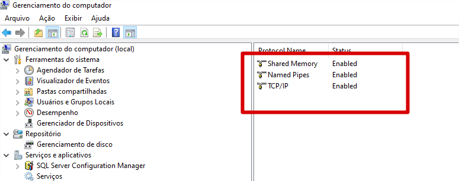
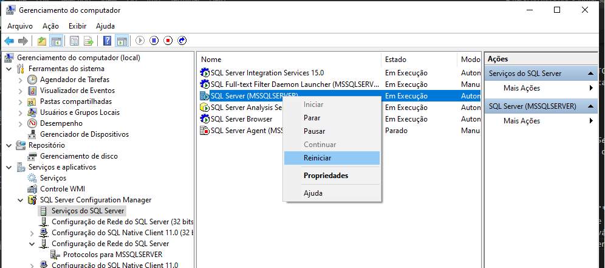
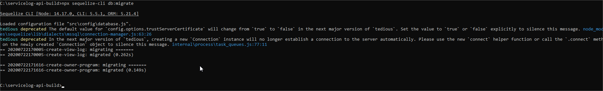
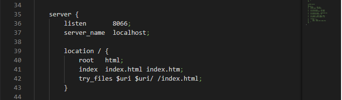
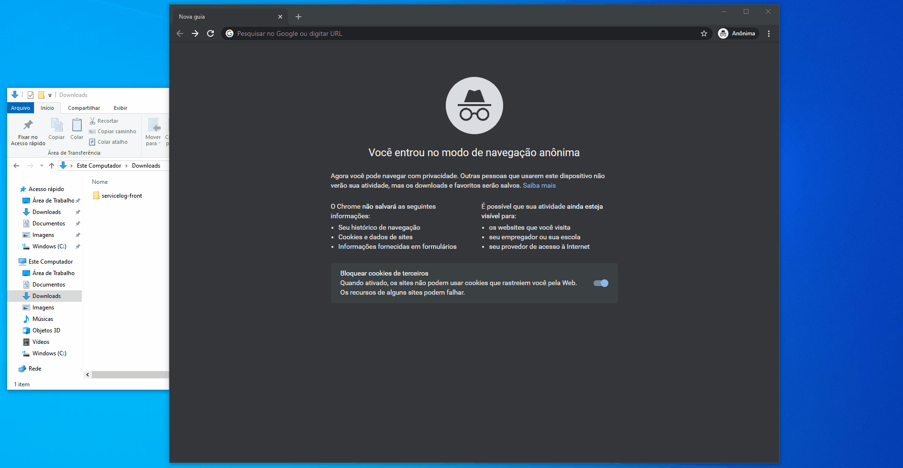

# Guia de Instalação e Configuração da Dashboard de Logs


## Serviço

Este serviço é utilizado para gravação e consulta dos logs dos testes realizados pelo TIR.

> Requisito: Node.js v12+ [Baixe aqui](https://nodejs.org/)

---

### ✨ Instalação

1. Baixe o pacote: [servicelog-api-build.zip](https://github.com/totvs/tir/raw/refs/heads/main/dashboard/servicelog-api-build.zip)
2. Extraia e abra a pasta do projeto
3. Configure o arquivo `.env` conforme instruções abaixo

---

### ⚙️ Configuração do Arquivo `.env`

#### Banco de Dados (`DB`)

- `TYPE`: modelo de banco onde sera `mssql` ou `sqlite`
- `STORAGE`: Caminho para o arquivo do banco de dados. Por padrão, o arquivo é salvo em ./db/dashboard.sqlite. (apenas para sqlite) 
- Para MSSQL:
    - `INSTANCENAME`: Nome da instância do SQL Server (apenas mssql).
    - `HOST`: Endereço IP ou hostname do servidor onde o banco está hospedado.
    - `USERNAME`: Nome de usuário com permissões de acesso ao banco.
    - `PASSWORD`:Senha do usuário do banco.
    - `DATABASE`: Nome do banco de dados onde os registros serão armazenados.

#### Caminhos de Arquivos

- `PATH_SERVER`: Diretório onde serão salvos arquivos JSONs em caso de falha na gravação no banco.
- `PATH_PROCESSED`: Diretório onde os arquivos JSONs serão movidos após terem sido processados com sucesso, especialmente em cenários de recuperação.

#### Porta da Aplicação

- `APP_PORT`: Porta de inicialização do serviço (ex: 3333)

#### Agendamento
- `SCHEDULE`: Define a frequência de verificação de arquivos jsons da pasta configurada no "pathServer".

- Utiliza a sintaxe padrão de agendamento cron. **Default**:
  ```
   * 7,12,18,23 * * *
  ```
  Executa às 7h, 12h, 18h e 23h diariamente.

> Valores válidos: segundos (0-59), minutos (0-59), horas (0-23), dia do mês (1-31), mês (1-12), dia da semana (0-7)

---

### 🚀 Inicialização

No diretório `/scripts-bats`, execute os scripts abaixo como **administrador**:

1. `install.bat` - Instala dependências via npm  
2. `service-mode.bat` - Instala a API como serviço  
3. `run.bat` - Inicia o serviço  

Para parar:

- `stop.bat`

---

## ℹ️ Procedimento para Microsoft SQL Server

### Habilitar TCP/IP

1. Pressione `Win + R` > digite `compmgmt.msc`
2. Navegue até: `Serviços e aplicativos > SQL Server Configuration Manager > SQL Server Network Configuration`  
3. Selecione a instância correta (mesma informada no .env) e habilite os protocolos TCP no menu exibido.
    - 


### Habilitar serviço SQL Server Browser

1. Navegue até `SQL Server Services`  
2. Com o botão direito clique em *SQL Server Browser* > "Iniciar"  
    - Se indisponível: Propriedades > aba *Serviço* > "Modo inicial": *Automático*  
3. Reinicie o serviço principal do SQL Server  
    - 


### 🔧 Criação das Tabelas (MSSQL)

1. Abra o terminal em `/servicelog-api-build`, raiz do projeto:
2. Execute:
```bash
npx sequelize-cli db:migrate
```
    - 

---

## 🔼 Instalação do Portal Web

O portal exibe gráficos de execuções dos ciclos de forma gerencial.

1. Baixe o portal: [servicelog-front.zip](https://github.com/totvs/tir/raw/refs/heads/main/dashboard/servicelog-front.zip)
2. Escolha um servidor web. Recomendamos o **Nginx**.

### Nginx: Instalação e Configuração

1. Baixe: [Nginx Downloads](http://nginx.org/en/download.html)  
2. Extraia em uma pasta  
3. No arquivo `conf/nginx.conf`, edite:
4. Inclua na chave `server` o trecho a seguir:
```
    listen       8066;
    server_name  localhost;
```

4.   Faça o mesmo para a chave `location / ` com o código abaixo:
```
        root   html;
        index  index.html index.htm;
        try_files $uri $uri/ /index.html;
```
  >A alteração deve ficar semelhante ao trecho abaixo:
  

5. Copie todo conteudo de `/servicelog-front` para a pasta `nginx-x.x.x/html`
6. Execute `nginx.exe` na pasta raiz

> ⚠️ Certifique-se de que a `APP_PORT` no `.env` e no `html/assets/config/appConfig.json` estejam iguais

- Abaixo um exemplo animado do processo:


---

### Nginx como Serviço do Windows (opcional)

1. Acesse `/servicelog-api-build/scripts-bats/nginx/`  
2. Execute `Install-service-server.bat` com permissões de **administrador**
3. Configure os campos `Path` e `Startup directory`
    - Path :  Ex. `Path/nginx.exe`
    - Startup directory :  Ex. `Path/to/nginx`
4. Clique em "Install service"
5. Execute o arquivo `Run-service-server.bat`

---

Pronto! Seu serviço de logs e o portal estão configurados e prontos para uso.
