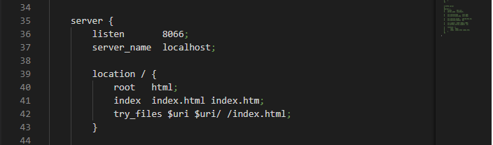
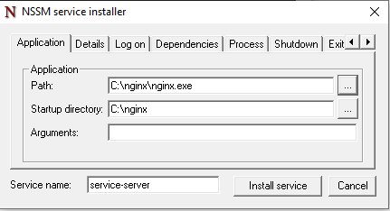

# Serviço
Serviço utilizado para gravação e consulta dos logs dos testes realizados pelo TIR.

O pacote servicelog necessita do pacote do [Node.js](https://nodejs.org/) versão v12+.

## Configuração
[Clique aqui e baixe o arquivo zip](https://github.com/totvs/tir/raw/master/dashboard/servicelog-api-build.zip).
Após a instalação procurar na pasta raiz do projeto o arquivo `.env` e realizar a configuração do serviço conforme os parâmetros abaixo.

- **database** - A Tag "DB" é responsavél pela comunicação do banco e possui os seguintes parâmetros:
	- **TYPE** - Tipo de banco de dados que serão armazenados os logs de execuções, podendo receber como parâmetros `mssql` para Microsoft SQL ou `sqlite` para SQLITE.
	- **STORAGE** - Apenas caso a opção de banco seja SQLITE. Representa o caminho do banco que por default fica na pasta "db" do projeto: `./db/dashboard.sqlite`.
	- **INSTANCENAME** - Nome da Instância do banco de dados.
	- **HOST** - Ip do servidor que está o banco de dados.
	- **USERNAME** - Usuário do banco de dados.
	- **PASSWORD** - Senha do usuário do banco de dados.
	- **DATABASE** - Nome do banco de dados criado para receber os registros.

- **PATH_SERVER** - Caminho da pasta onde seram enviados os arquivos json caso o servidor não consiga gravar o registro no banco de dados.
- **PATH_PROCESSED** - Pasta de arquivos que já foram processados quando o servidor apresentar uma contigência.

- **APP_PORT** - Porta que será inicializado a aplicação.

- **SCHEDULE** - Nessa opção é configurado qual será frequência de verificação de arquivos jsons da pasta configurada no "pathServer". 
Ela possui uma sintaxe abaixa

#### Campos permitidos
```
 # ┌────────────── segundos (optional)
 # │ ┌──────────── minutos
 # │ │ ┌────────── horas
 # │ │ │ ┌──────── dias do mês
 # │ │ │ │ ┌────── mês
 # │ │ │ │ │ ┌──── dia da semana
 # │ │ │ │ │ │
 # │ │ │ │ │ │
 # * * * * * *
```

### Valores permitidos

|     campos   | valores permitidos  |
|--------------|---------------------|
|   segundos   |         0-59        |
|   minutos    |         0-59        |
|     hora     |         0-23        |
|  dia do mês  |         1-31        |
|      mês     |     1-12 (or names) |
|dia da semana |    0-7 (nomes ou números, 0 ou 7 domingo à sábado)  |

- No padrão está da seguinte forma:
	` * 7,12,18,23 * * * ` - Dessa forma será executado o serviço as 7hrs, 12hrs, 18hrs e 23hrs todos os dias.

## Instalação
Após a instalação procurar na raiz do projeto a pasta /scripts-bats e executar os scripts na sequência abaixo e em modo de administrador.

1. install.bat - Descompactar os pacotes do npm.
2. service-mode.bat - Instalação a api em modo de serviço.
3. run.bat - Inicializa o serviço.

Em caso de necessidade poderá desligar o serviço com o bat abaixo.

 - stop.bat - Desliga o serviço

## Observações
>Caso utilize o **Microsoft SQL Server** será necessario habilitar a comunicação TCP e ativar o SQL Server Browser (responsável por escutar as solicitações de entrada de recursos do Microsoft SQL Server e fornecer informações sobre as instâncias do SQL Server instaladas no computador) conforme o passo a passo a seguir:

### Habilitar portas TCP do Banco
1. Pressione *Windows key + R*
2. Na caixa de dialogo digite *Digite compmgmt.msc*
3. Navegue por "*Serviços e aplicativos > SQL Server Configuration Manager > SQL Server Network Configuration*" e selecione a mesma instancia do banco informado no arquivo `.env`
4. Após selecionada a instância, no menu a direita clique com o botão direito sob o protocolo e habilite **faça isso para todas as opções**:
    


### Habilitar serviço SQL Server Browser
1. Dentro do menu lateral "*SQL Server Configuration Manager*" selecione a opção "*SQL Server Services*"
2. No menu a direita clique com o botão direito sob a opção *SQL Server Browser* e clique em "inciar"
>Talvez a opção "iniciar" não esteja disponível, nesse caso, com o botão direito vá em "propriedades" entre na aba "serviço" e na caixa "modo inicial" selecione a opção "Automático"
3. Após realizar todas as alterações, ainda na opção "*SQL Server Services*" do menu lateral, reinicie o serviço do banco
    


## Criação das tabelas
Por fim será necessario criar as tabelas através de um comando conforme a seguir:

1. Abra um cmd no diretorio raiz dos arquivos
2. Execute o comando `npx sequelize-cli db:migrate`
	

# INSTALAÇÃO DO PORTAL

- Esse Portal tem como intuito exibir os gráficos com execuções que ocorrerão nos ciclos.
- [Clique aqui e baixe o arquivo zip](https://github.com/totvs/tir/raw/master/dashboard/servicelog-front.zip).

!!! aviso
    Após baixar o pacote com o portal deve ser selecionado um servidor web de sua preferência para colocar seu portal, como recomendação neste exemplo usaremos o Nginx, mas fique a vontade para selecionar o que esteja mais acostumado.

## Instalação e configuração do Nginx:
Entre na página [Nginx](http://nginx.org/en/download.html) e na parte de download e selecione o pacote conforme seu sistema operacional.
Após isso deve seguir os seguintes passos:

1.   Descompactar o nginx no caminho desejado.
2.   Abrir o arquivo "conf/nginx.conf"
3.   Dentro da chave `server` inclua trecho a seguir:

        listen       8066;
        server_name  localhost;

4.   Faça o mesmo para a chave `location / ` com o código abaixo:

        root   html;
        index  index.html index.htm;
        try_files $uri $uri/ /index.html;

    >Sua alteração ficará algo semelhante ao seguinte:
    

5. Copie os arquivos do portal para a pasta /html

6. Por fim na pasta raiz do nginx e execute o `nginx.exe`

## Veja um exemplo a seguir:


>## Observações
A porta do web server deve ser a mesma `APP_PORT` configurada arquivo .env.
Nesse caso fica no arquivo html/config/appConfig.json


## Nginx como serviço do windows
Para definir o nginx como um serviço do windows siga o seguinte procedimento:

1.  Na raiz do projeto vá até o diretório "/scripts-bats/nginx/"
2.  Execute o `Install-service-server.bat` **em modo admnistrador**.
3.  No campo "Path" defina o executavel do nginx e no campo "Startup directory" defina o local onde se encontra o executavel.    

4.  Clique em "install service" e aguarde finalizar.
5.  Pronto agora o que serviço ja está instalado é só roda-lo com `Run-service-server.bat`
