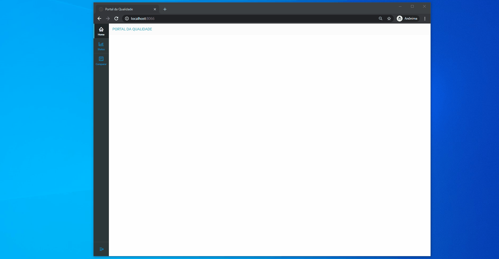

# UTILIZAÇÃO

## Configurando TIR
Configurando o TIR para as execuções 

## Status dos Testes
Página possui o intuito de mostrar as execuções de testes para um determinado período, possui as divisões por status geral, statusXfalhas e status por suite. No gráfico de status por suite quando clica na quantidade que falhou, é aberto uma tela onde é possivel fazer analise daquele erro que foi encontrado.

- Veja o exemplo a seguir:

    

## Comparar Testes

Página utilizada para comparação de um periodo com outro, é possivel selecionar diversos periodos e comparar como foi a execução entre eles.

- Veja o exemplo a seguir:

    