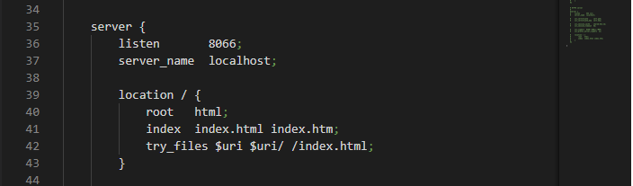
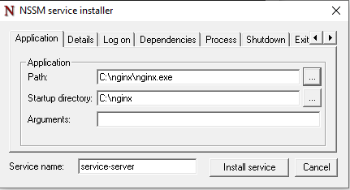

# INSTALAÇÃO DO PORTAL

- Esse Portal tem como intuito exibir os gráficos com execuções que ocorrerão nos ciclos.

!!! aviso
    Após baixar o pacote com o portal deve ser selecionado um servidor web de sua preferência para colocar seu portal, como recomendação neste exemplo usaremos o Nginx, mas fique a vontade para selecionar o que esteja mais acostumado.

## Instalação e configuração do Nginx:
Entre na página [Nginx](http://nginx.org/en/download.html) e na parte de download e selecione o pacote conforme seu sistema operacional.
Após isso deve seguir os seguintes passos:

1.   Descompactar o nginx no caminho desejado.
2.   Abrir o arquivo "conf/nginx.conf"
3.   Dentro da chave `server` inclua trecho a seguir:

        listen       8066;
        server_name  localhost;

4.   Faça o mesmo para a chave `location / ` com o código abaixo:

        root   html;
        index  index.html index.htm;
        try_files $uri $uri/ /index.html;

    >Sua alteração ficará algo semelhante ao seguinte:
    

5. Copie os arquivos do portal para a pasta /html

6. Por fim na pasta raiz do nginx e execute o `nginx.exe`

## Veja um exemplo a seguir:

>## Observações
A porta do web server deve ser a mesma `APP_PORT` configurada arquivo .env.
Nesse caso fica no arquivo html/config/appConfig.json

## Nginx como serviço do windows
Para definir o nginx como um serviço do windows siga o seguinte procedimento:

1.  Na raiz do projeto vá até o diretório "/scripts-bats/nginx/"
2.  Execute o `Install-service-server.bat` **em modo admnistrador**.
3.  No campo "Path" defina o executavel do nginx e no campo "Startup directory" defina o local onde se encontra o executavel.    

4.  Clique em "install service" e aguarde finalizar.
5.  Pronto agora o que serviço ja está instalado é só roda-lo com `Run-service-server.bat`
