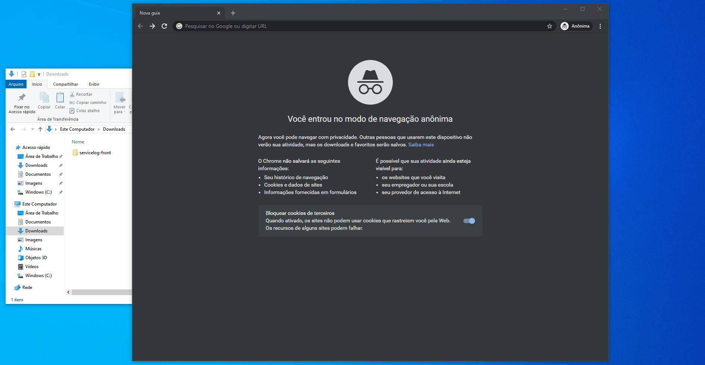

# INSTALAÇÃO DO PORTAL

- Esse Portal tem como intuito exibir os gráficos com execuções que ocorreram nos ciclos.

!!! aviso
    Após baixar o pacote com o portal deve ser selecionado um servidor web de sua preferência para colocar seu portal, como sugestão existe o Nginx, mas fique a vontade para selecionar o que esteja mais acostumado.

## Como instalar o Nginx:
Entre na página [Nginx](http://nginx.org/en/download.html) na parte de download e selecione o pacote conforme seu sistema operacional e faça o download.
Após isso deve seguir os seguintes passos:

- Descompactar o nginx no caminho desejado.
- Abrir o arquivo conf/nginx.conf localizando o trecho que contém "server {" e colocar e inserir o seguinte trecho:
## nginx.conf
    server {
        listen       8066;
        server_name  localhost;

        location / {
            root   html;
            index  index.html index.htm;
            try_files $uri $uri/ /index.html;
        }
    }
- Copiar os arquivos do portal para a pasta /html
- Abrir a pasta e executar o executavél nginx.exe

- Veja o exemplo a seguir:

    

