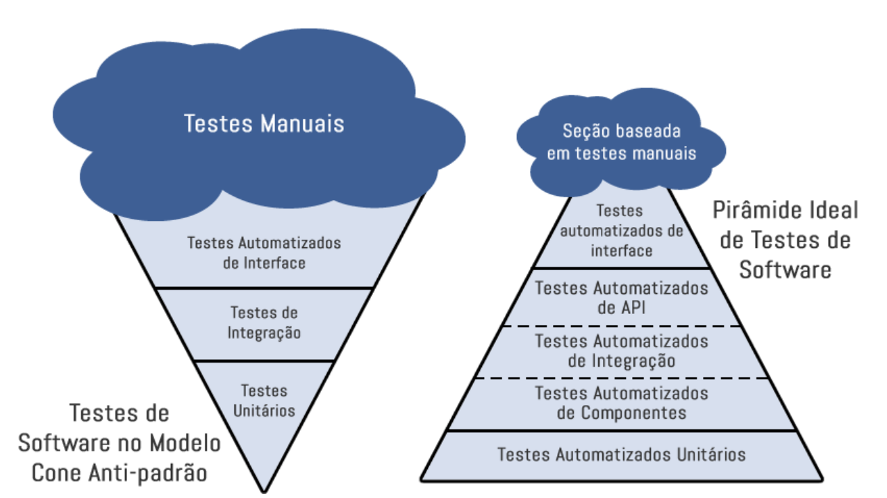
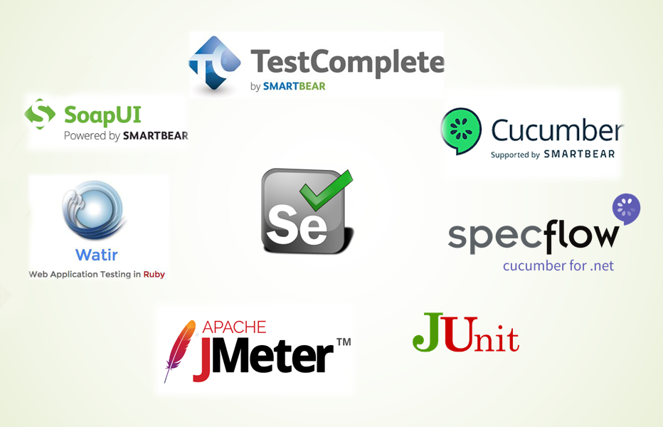

#Automação de Testes

Automatizar testes, baseia-se no uso de uma ou mais ferramentas para executar testes em um software, através da aplicação de estratégias comparando os resultados esperados com os resultados reais. 

Seus objetivos são a redução do envolvimento humano em atividades manuais, diminuindo tempo de execução, ampliando itens validados de modo pontual ou contínuo, bem como reduzindo custos ao longo do tempo.

A importância e utilidade dos testes automatizados, ficam claras quando analisamos a pirâmide de testes:

##Tipos de validação

**Funcionalidade**

Testa os requisitos funcionais da aplicação e software. Resumidamente verificar se a aplicação está apta a realizar as funções na qual foi desenvolvida para fazer.

Pode ser realizados testea Caixa Branca (a nível de código) ou Caixa Preta (ação do usuário) para validações funcionais.
 
O teste funcional pode ser manual, realizado de forma automatizada ou uma mistura dos dois.

**Performance**

Consiste em avaliar a capacidade de resposta, robustez, disponibilidade, confiabilidade e escalabilidade de uma aplicação, conforme a quantidade de conexões simultâneas, avaliando seu desempenho em alta carga de trabalho e considerando seu comportamento em circunstâncias normais.

São diversas a estratégias de teste, como: Teste de Carga, Teste de estresse, Teste de endurância ou Teste de Resistência, Teste de Subida Rápida, Teste de Configuração.

**Teste unitário** 

Visa validar o menor componente do sistema,geralmente validado a nível de código (desenvolvimento).

##Automatizar sempre?
Conforme mencionado acima, automação reduz a probabilidade de erros das tarefas de teste, libera tempo para que o resto do trabalho de testes seja realizado da melhor forma e provê mais segurança ao sistema, por exemplo, quando é feita uma mudança no código, testes automatizados permitem identificar se algo foi quebrado.

Podemos dizer que a automação de testes é um investimento e esforço de médio e longo prazo, cujos benefícios serão percebidos com o passar do tempo. Reforça-se que é importante considerar os casos em que cabe utilizar a automação. 

É preciso analisar cada caso para definir quais realmente valem a pena ser automatizados.

Considerar que, mesmo quando se opta por usar uma ferramenta de automação de teste, ainda é necessário utilizar testes manuais para diversas funcionalidades.

Automação é o caminho para ampliar a qualidade, mas não é a solução de todos os problemas. É imprescindível que exista uma estrutura de processo de testes, para sustentar o uso da ferramenta.

##O que devemos automatizar?

Para iniciar atuação com automação de testes, é indicado fazer uma avaliação prévia de quais itens do sistema podem ser automatizados e agregarão valor sendo automatizados.Este questionamento será respondido a partir de outros. 

Abaixo temos algumas perguntas que podem ser ser feitas, e de acordo com as respostas, conseguiremos definir o que será automatizado:

***Conseguiremos reutilizar os testes automatizados deste módulo/rotina?**

***Temos conhecimento do resultado esperado quanto a execução deste módulo/rotina?**

***Existe viabilidade quanto a inclusão de tempo entre as atividades da equipe, para manutenir os scripts de teste e mantê-los atualizados?**

***No caso de sistema legado, as funções críticas que precisam ser validadas periodicamente podem ser automatizadas? Teremos ganho de tempo com a automatização?**

Os questionamentos citados acima são algus dentre outros que podem ser utilizados, no momento da definição quanto a itens que poderão ser automatizados.

##Ferramentas de automação de testes
Existem no mercado diversas ferramentas para automatizar testes. Ferramentas com funcionalides distintas para atender as necessidades em todos os tipos de testes existentes o mercado.

Alguns exemplos:

###**Selenium**

Selenium é uma ferramenta Open source, usada principalmente para aplicações web, sendo uma das ferramentas mais populares e usadas do mercado. 

A estrutura de testes do Selenium atua em vários browsers e plataformas como Linux, Mac, Windows, Firefox, Chrome, IE, assim como em Headless Browsers, abaixo algumas atribuições:

O Selenium IDE, um add-on de navegador, permite gravar e reproduzir, o que significa que o testador pode usar estas funcionalidades até mesmo se estiver aprendendo a usar o Selenium IDE.

Já o Selenium WebDriver ajuda a criar scripts de automação de testes mais complexos e avançados. 

***Prós**

*Código aberto

*Variedade de recursos

*Suporte para vários SoapUI

***Contras**

*Apenas para itens baseados em Web

*Não existe canal oficial de suporte

###**SoapUI**

SoapUI é uma ferramenta open source cuja principal função é consumir e testar Web Services. Entre as suas principais características, podemos destacar as seguintes:

*Testes funcionais, carga e stress

*Execução de diversos testes em paralelo

*Suporta criação de testes complexos utilizando scripts Groovy

***Prós**

*Diversidade de testes possíveis 

*Possibilidade de multiplas execuções

***Contras**

*Para serviços da web, necessário ter WSDL

*Para automação de testes, a criação de scripts pode conter muitas etapas. Dificultando para iniciantes.

###**Cucumber**

Cucumber é uma ferramenta usada para executar testes de aceitação automatizados que foram criados em um formato BDD. 

Um de seus recursos é a capacidade de realizar descrições funcionais de texto simples (escritas numa linguagem chamada Gherkin) como testes automatizados.

***Prós**

*Possibilidade de reutilizar etapas

*Automatizar testes usando tabelas 

*Escrita prática com Gherkin

***Contras**

*Pode ser necessário conhecimento técnico para inserir informações necessárias ao caso de teste

###**Test Complete**

Test Complete atualmente é uma ferramenta de automação de testes vendido pela SmartBear, que realiza testes e verifica a lógica do negócio, o desempenho, a funcionalidade, a interface, a persistência dos dados, o desempenho do servidor, etc, conforme programado pela equipe de testes.

Ele contempla testes funcionais, não funcionais, regressão permitindo criar projetos diversos na estrutura da ferramenta para atender estes testes.

***Prós**

*Interface prática

*Possui diversas funcionalidades para integração com softwares

***Contras**

*Pode exigir muitas etapas manuais para atualizar casos de teste

###**JMeter**

Ferramenta open source utilizada para teste de performance, pode ser utilizado para outros tipos de teste, mas o carro chefe da ferramenta é validar performance.
Projetado para testar o comportamento funcional de carga e medir o desempenho. Foi originalmente projetado para testar aplicativos da Web, mas desde então foi expandido para outras funções de teste.

Ele pode ser usado para simular uma carga pesada em um servidor, grupo de servidores, rede ou objeto para testar sua força ou para analisar o desempenho geral sob diferentes tipos de carga.
Tem ainda capacidade de carregar e testar o desempenho de diversos tipos de aplicativos, servidores, protocolos.

***Prós**

*Interface prática e intuitiva

*Diversos recursos úteis para texto

***Contras**

*Necessário conhecimento para efetuar instalação, pois pode acarretar problemas de utilização posteriormente

