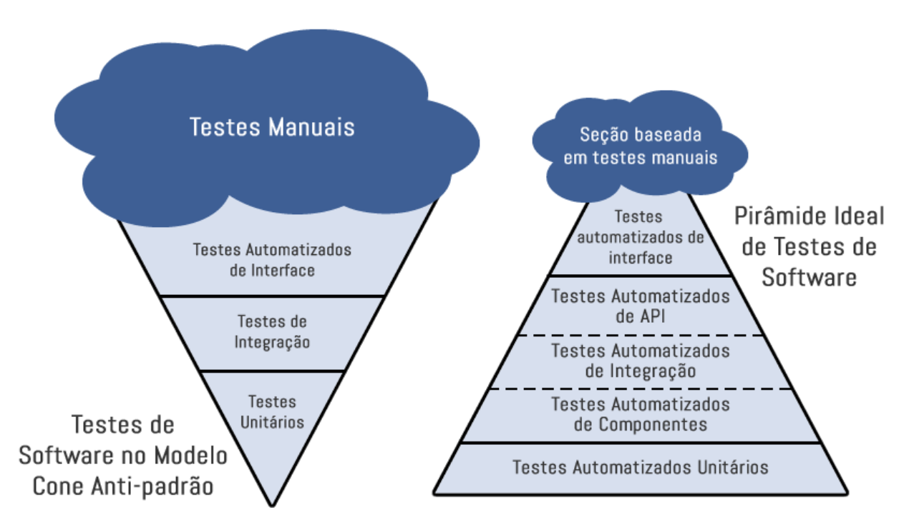

#TESTE DE SOFTWARE

##            Processo de Qualidade x Processo de Teste

###Processo de Qualidade
Processo de Qualidade é um conjunto de normas pré estabelecidas com objetivo de  garantir a qualidade de algo. Aplicado a desenvolvimento de software, conjunto de normas que formam um processo a ser seguido , a fim de garantir a qualidade do software.

Sua aplicação se estende desde captação de requisitos até a entrega do sistema ao usuário final. 

###Processo de Teste

O processo de teste é uma etapas do processo de qualidade. Nele encontram-se as diretrizes de processo e procedimentos a serem executados durante a etapa de testes.

##Introdução a Teste de Software

Teste de software é uma etapa de controle de qualidade, utilizada para assegurar que o software está contemplando todas as funcionalidades esperadas e que estas estão funcionando corretamente.

Os testes não garantirão que o software estará isento de bugs, mas os esforços empenhados nesta etapa, ampliarão a qualidade do produto final.

Usa-se tipos, níveis e técnicas de teste para verificar os objetivos dos testes em diversos momentos do desenvolvimento de software (ciclo de vida), de acordo com as necessidades de validação.

É corriqueira a implementação de mais de um tipo, nível e técnica de teste empregada em um software para ampliar a garantia da qualidade do mesmo.

Abaixo temos mais informações sobre estes itens:

**Testes Funcionais(Caixa Preta):** Estes testes são realizados para validar se as implementações atendem à função designada, ou seja, o resultado esperado.

 Bem como se não fere regras de negócio associadas às funcionalidades do software, que podem estar divergentes das determinações existentes em sua documentação.

De modo geral, são utilizados para avaliar as funções do sistema, simulando a ação do usuário.

**Teste de Sistema:** Nestes testes são colocador parâmetros pré estabelecidos na aplicação, a fim de se obter um resultado esperado, podem ser executados manualmente ou de modo automatizado.

**Teste de Regressão:** Uma alteração feita em uma ou mais partes do sistema, seja correção ou implementação, pode afetar acidentalmente o comportamento de outras partes do mesmo código. O teste de regressão envolve a execução de testes para detectar esses efeitos colaterais indesejados.

São testes repetitivos que tem por objetivo garantir que partes do sistema que funcionavam anteriormente, permaneçam funcionando após as implementações.

**Teste de Integração**: O teste de integração tem por objetivo validar diferentes módulos em um sistema, analisando a integração entre eles. 

A execução de testes funcionais, em todas suas variações, tem por objetivo garantir a funcionalidade do sistema , para que o produto atenda as especificações e necessidades.

##Testes Manuais

Os testes manuais são realizados por seres humanos através de casos de testes, que possuem o passo a passo com informações necessárias para validar se a execução dos testes estão de acordo com o resultado esperado. 

No teste manual não há auxílio de nenhuma ferramenta para execução dos testes.

##Testes Automatizados

No teste automatizado os testes são executados através de robôs (ferramentas e frameworks) que utilizam scripts com elementos de entrada e saída, para validar se os testes passaram ou falharam,  de acordo com o escopo definido e resultado esperado.

##Benefícios Teste Manuais e Automatizados

Para automatizar um cenário de teste é necessário ter conhecimento do resultado esperado, este pode ser adquirido através de um execução prévia, manual. Além deste ponto, para execução dos testes manuais leva-se em consideração o conhecimento do analista que está criando e testando os casos de teste.

Em contra partida, execução manual onera tempo, aumentando custos, pode ser interrompida por fatores humanos, alheios a qualquer planejamento de projeto e tempo, alterando um possível fluxo predefinido.

 
Em oposição ao teste manual, os testes automatizados contam com pouca interação humana, que é essencial para elaboração dos scripts, após este ponto, geralmente todos os demais processos são automatizados.

Testes automatizados são explícitos, pois permitem saber por quais pontos o robô passou para chegar em determinado erro ou acerto.

Outro benefício é a velocidade em comparação aos testes manuais, já que não há atraso entre o tempo de entrada e a verificação.

Podemos usar como exemplo a execução de testes automatizados em mais ambientes diversos da mesma aplicação. 

Consegue-se obter um retorno rápido e preciso da execução em todos, visto que as mesmas ações realizadas manualmente levariam mais tempo para execução.

Contras da automação de testes: inicialmente, será necessário demandar tempo para elaboração dos scripts, que além da parte técnica precisam ser consistente com o resultado esperado do sistema, em alguns casos, será necessário conhecer ou obter apoio de terceiros quanto a regra de negócio para criar os scripts.

Importante garantir que todos os ambientes, bases e outros itens que serão utilizados na automação estejam preparados.

A longo prazo ter automatização dos testes, é vantajoso pois reduz o tempo de utilização de recursos humanos nas equipes, bem como para casos em que exista um número grande de validações simultâneas por exemplo, automatizar é a melhor opção.

Liberar tempo hábil entre os recursos da equipe, permite que eles possam utilizar este tempo para validar outras partes do sistema que em alguns casos, por exemplo, não será possível automatizar e outras validações importantes para garantir a qualidade do produto.

##Custo Teste Manual X  Teste Automatizado

De acordo com os itens mencionados acima, o custo tanto do teste manual quanto ao automatizado depende do contexto no qual serão aplicados.

Para funcionalidades em que os testes são rápidos, que não demandam repetição, serão executadas em ambiente único, ou que demandariam mais tempos na criação do script de teste do que efetivamente validando o sistema, o teste manual é indicado , pois terá menor custo que o automatizado.

Em contraponto, rotinas repetitivas, que demandam execução contínua, diversidade de ambientes e poderiam onerar muito tempo para ser executadas, automação tem ganho a longo prazo.

Pode-se utilizar ambos os métodos de acordo com a necessidade e disponibilidade, a fim de garantir a qualidade do sistema a ser testado.

