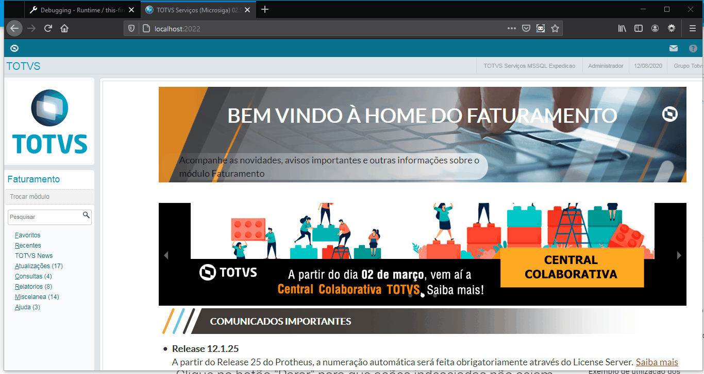
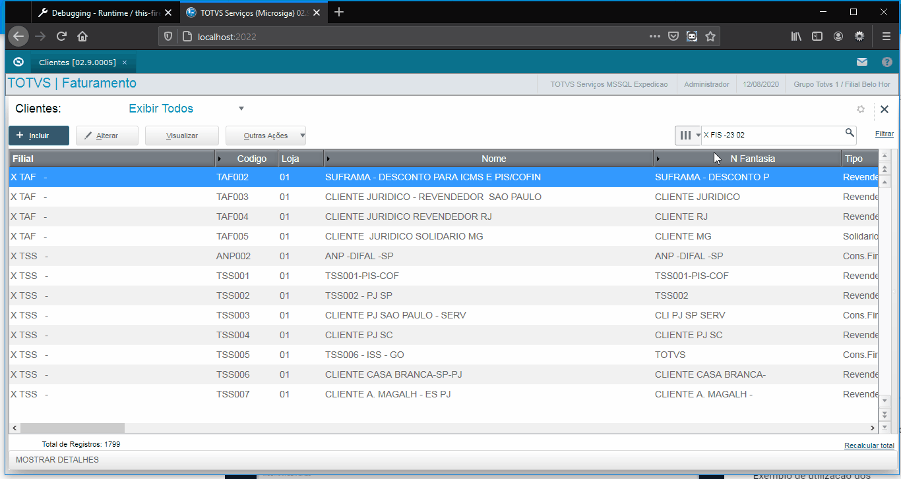

# TIR RECORD PROTHEUS 1.0.0

- Esse gravador tem como objetivo capturar ações que o usuário realiza no [Protheus WebApp (Smartclient+HTML)](https://tdn.totvs.com/pages/viewpage.action?pageId=448596783) e transformar essas ações em um script para o framework [TIR](https://github.com/totvs/tir).

???+ note "Nota"
    Cada ação é gravada, por isso, leia com atenção cada tópico e utilize os recursos da ferramenta para uma melhor experiência.

## Instalação
### Como instalar no Firefox:
Na versão atual, a extensão será distribuida através da [loja do Firefox](https://addons.mozilla.org/en-US/firefox/addon/tir-record/).

## SetupClass
### Após instalar configure o método "SetupClass" do TIR:
 SetupClass é um método que é executado antes de todos os outros casos de testes. [Mais informações...](https://docs.python.org/3/library/unittest.html?highlight=setupclass#unittest.TestCase.setUpClass).

 - No TIR Record para o SetupClass você precisa informar os métodos:
- Método [Setup](https://totvs.github.io/tir/webapp.html?highlight=setup#tir.main.Webapp.Setup): contendo as informações dos campos Programa Inicial, Database, Grupo, Filial e Ambiente.
- Método [Program](https://totvs.github.io/tir/webapp.html?highlight=program#tir.main.Webapp.Program): contendo as informações para o preenchimento do campo que pesquisa a rotina/programa.

    

## Criação
### Agora crie os arquivos e comece a gravar as ações:
 Após realizar as configurações iniciais (configurar o método SetupClass), iremos criar os scripts:

???+ warning "Aviso"
    Lembre-se que o TIR realiza grande parte das ações iniciais para entrar no ambiente então considere os métodos "Setup" e "Program" para o ponto de partida na hora da gravação.
 
 - Clique no icone do TIR Record.
 - Clique em criar.
 - Informe o nome dos script de teste.
 - Informe o nome do primeiro caso de teste.
 

## Parar gravação
### Clique no botão "Parar" para que ações indesejadas não sejam gravadas:
O botão "Parar" evita que ações realizadas no Protheus WebApp sejam gravadas caso deseje realizar alguma ação que não deve ser gravada utilize esse botão.

## Executar ação de clique em um botão
### Como executar as ações de clique em botões (SetButton):
As ações de clique em botões no TIR são realizadas utilizando o método SetButton, este método é capaz de realizar um clique em um botão normal ou em um botão com subníveis.O TIR Record já é capaz de reconhecer quando um botão possui subníveis (".tmenupopup") após o clique.

???+ todo "SetButton"
    SetButton é um método responsável por realizar as ações de clique em botões. [Mais informações...](https://totvs.github.io/tir/webapp.html?highlight=setbutton#tir.main.Webapp.SetButton).

Uso do SetButton(Subníveis):

## Pesquisar um registro:
### Realizar pesquisa, método SearchBrowse:

## Preenchimento de inputs em um Enchoice:

???+ warning "Aviso"
    Os preenchimentos de inputs precisam de um cuidado especial, pois, o gatilho para que o TIR Record capture os valores de um input é quando o campo perde o foco.

Algumas situações que devem ser consideradas:

- ComboBox:
    Inputs do tipo ComboBox devem ser preenchidos utilizando cliques e não atalhos do teclado.

- Inputs sem o atributo nome presente no *HTML*:
    Inputs sem o atributo nome presente no html irão disparar uma notificação no browser, o usuário então deve clicar na label mais próxima ao input.

- CheckBox:
    Para que o clique em um check box seja reconhecido não clique no texto, a ação de clique em um checkbox só é capturada quando o usuário realiza a ação no componente.

## Cliques em labels ou em folders:
Ao realizar o click em textos (elementos "label/span ...") ou em pastas (elementos ".tfolder") o TIR Record reconhece o clique e grava a ação veja o exemplo a seguir:

## GRID
Atenção a forma de gravação em grid ocorre de forma diferente do padrão, leia abaixo como deve ser realizada cada ação para cada método.

### SetValue na GRID
O SetValue em uma grid reconhece automaticamente qual o número da grid na tela e qual número da linha.
Para que o SetValue seja gravado de forma correta antes de começar a preencher os campos da grid siga os seguintes passos:

    - Pare o gravador.
    - Preencha os campos desejados.
    - Clique em continuar no gravador.
    - Agora clique em cima do campo desejado com o botão **esquerdo** do mouse.
    - Após todos os campos serem gravados, lembre-se de adicionar o LoadGrid()
        utilizando o botão "+ Métodos > LoadGrid()" do gravador.
    
### Exemplo utilização SetValue (GRID).

## Botão "+Métodos"
### A opção +Métodos do TIR Record permite que você crie alguns métodos adicionas:
- Método AsserTrue():
	O método AssertTrue ou AssertFalse deve ser utilizado ao final de cada caso de teste, [acesse a documentação do TIR para mais informações](https://totvs.github.io/tir/webapp.html?highlight=assert#tir.main.Webapp.AssertTrue)
- Método AsserFalse():
	O método AssertTrue ou AssertFalse deve ser utilizado ao final de cada caso de teste, [acesse a documentação do TIR para mais informações](https://totvs.github.io/tir/webapp.html?highlight=assert#tir.main.Webapp.AssertFalse)

- Método LoadGrid():
	Os métodos (SetValue, CheckResult, *SetKey('Down')*) quando utilizados com o parâmetro **grid = True** necessitam de um comando a mais para que as ações sejam executadas,
    utilize o comando LoadGrid para isso. [Clique aqui para mais informações](https://totvs.github.io/tir/webapp.html?highlight=loadgrid)
	
- Método CheckResult ( modo de validação ):
    Quando a caixa do CheckResult estiver marcada o modo de validação do TIR Record PROTHEUS é ativado, este modo de validação muda a funcionalidade da extensão as gravações de comandos SetValue não serão mais efetivadas e agora com o clique do botão esquerdo do mouse é possível gravar o comando CheckResult do TIR ( **Atenção válido para Enchoice/Grid**)

### Exemplo de utilização:

## Validação
Para validar valores utilizando o TIR Record PROTHEUS você precisa ativar o modo de validação, este modo de validação contempla o método CheckResult - Enchoice e CheckResult - Grid do TIR.

### CheckResult Enchoice/Grid
Para validar os valores preenchidos em campos utilizando o TIR existe o método CheckResult, para gravarmos este passo você deve executar os seguintes passos:

- Clicar no botão +Métodos.
- Clicar em CheckResult (Uma notificação será lançada avisando que o modo de validação foi ativado).
- Clicar nos campos nos quais deseja validar

### Exemplo Enchoice

### Exemplo Grid

## Como finalizar e baixar:
Para finalizar e baixar o script gerado clique no botão "Finalizar" e depois clique no botão "Baixar".

???+ warning "Aviso"
    Lembre-se que ao final de cada caso de teste deve ser adicionado um comando AssertTrue ou AssertFalse.

